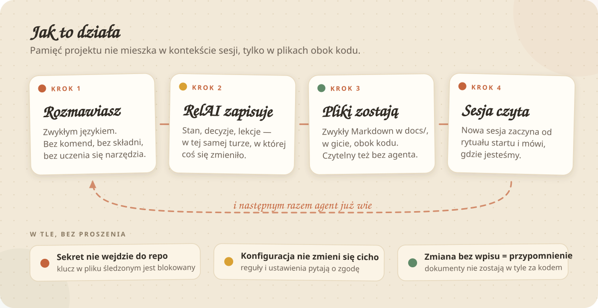

<p align="center">
  
</p>

<p align="center">
  <em>Wersja 1.6.0 &nbsp;·&nbsp; licencja MIT &nbsp;·&nbsp; wymaga Claude Code albo Cursora, plus Node.js 14+ &nbsp;·&nbsp; zero zależności npm</em>
</p>

**RelAI to plugin do Claude Code (od 1.5.0 także adapter Cursora), który zamienia rozmowę
z agentem w prowadzony projekt.**
Ustalenia, decyzje, stan prac i historia zostają w plikach obok kodu — a nie w kontekście sesji,
który za chwilę zniknie.

<details>
<summary><strong>English summary</strong></summary>

RelAI is a documentation-first process framework for Claude Code. Your project's state, decisions,
lessons and plans live in plain Markdown files next to the code, so every new session starts by
reading where the work actually is instead of asking you again.

Install:

```bash
claude plugin marketplace add nowilus/relai
```

```bash
claude plugin install relai@relai
```

Then open Claude Code in a project folder and just talk. The plugin asks for consent, asks exactly
three questions, and generates the structure. Documentation is generated in the project's language
— the plugin's own docs and this README are Polish, but a project set to English gets
`docs/STATE.md`, `JOURNAL.md`, `LESSONS.md`, `DECISIONS.md`, `SETTINGS.md`, `COMMANDS.md`.
Nine commands, nine hooks, four project profiles, MIT licence.

</details>

---

## Znasz to?

Wracasz do projektu po tygodniu. Otwierasz sesję i pierwsze, co słyszysz, to pytanie, na które
odpowiadałeś już trzy razy. Agent nie wie, że dwa tygodnie temu odrzuciliście bibliotekę X i
dlaczego. Nie wie, że moduł płatności czeka na decyzję klienta. Nie wie, co jest zrobione, a co
tylko wygląda na zrobione.

Więc tłumaczysz od nowa. Za tydzień znowu. A dokumentacja — jeśli w ogóle powstała — opisuje stan
sprzed sześciu commitów.

Problem nie leży w tym, że agent jest słaby. Leży w tym, że **pamięć sesji jest ulotna, a nikt nie
pilnuje, żeby to, co ustalone, wylądowało w pliku.**

## Co robi RelAI

- **Pamięta za Ciebie.** Każda zmiana funkcjonalna trafia do dziennika i do pliku stanu — w tej
  samej turze, w której powstała. Nie „na koniec sesji", nie „jak będzie czas".
- **Nie pyta dwa razy.** Odpowiedź udzielona raz zostaje zapisana i jest respektowana. Decyzja
  zamrożona nie wraca jako propozycja.
- **Uczy się Twoich poprawek.** Powiedziałeś „nie rób tego tak"? To zdanie ląduje w rejestrze lekcji
  bez pytania. Gdy uwaga wraca drugi raz, RelAI proponuje wpisać ją na stałe do reguł projektu.
- **Pilnuje granic.** Klucz API nie wejdzie do repozytorium. Reguły projektu nie zmienią się po
  cichu. Konfiguracja produkcyjna nie zostanie nadpisana bez kopii sprzed zmiany.
- **Nie pozwala dokumentom spuchnąć.** Gdy dziennik urośnie ponad próg, przy zamykaniu sesji
  najstarsza historia sama przenosi się do archiwum — w całości, bez skracania — a w żywym pliku
  zostaje linia z linkiem. Nic nie ginie, kontekst sesji odzyskuje miejsce.
- **Działa w zwykłej rozmowie.** Komendy istnieją, ale są skrótem dla rzadszych operacji — nie
  warunkiem działania. Nie musisz uczyć się składni.

<p align="center">
  
</p>

## Instalacja

RelAI działa w dwóch narzędziach i instaluje się w nich **inaczej**. Wybierz swoją ścieżkę —
drugiego narzędzia nie potrzebujesz.

| | Claude Code | Cursor |
|---|---|---|
| Co instalujesz | plugin z marketplace'u | adapter z repozytorium |
| Zasięg instalacji | **raz na maszynę**, działa w każdym folderze | **raz na projekt**, pliki lądują w projekcie |
| Potrzebne repozytorium RelAI na dysku | nie | **tak** — hooki wskazują jego ścieżkę |
| Aktualizacja | `claude plugin update` + restart | `git pull` + ponowny instalator w projektach |

### A. Claude Code — plugin

**1.** Dodaj źródło pluginu:

```bash
claude plugin marketplace add nowilus/relai
```

**2.** Zainstaluj:

```bash
claude plugin install relai@relai
```

(Wewnątrz sesji Claude Code te same dwa kroki to `/plugin marketplace add nowilus/relai`
i `/plugin install relai`.)

**3.** Otwórz Claude Code w folderze projektu i napisz cokolwiek. RelAI rozpozna folder i zapyta,
czy założyć strukturę. **Odmowa jest ostateczna** — plugin zapisuje marker trybu gościa i nie
wraca do tematu w tym folderze.

> **Po każdej aktualizacji pluginu zrestartuj aplikację.** Sesja uruchomiona przed aktualizacją
> nadal wykonuje starą wersję — to nie usterka, tylko sposób ładowania pluginów.

### B. Cursor — adapter (bez Claude Code)

Cursor nie ma marketplace'u pluginów, więc RelAI mieszka u Ciebie jako **zwykłe repozytorium**,
a instalator kładzie w projekcie reguły, komendy, skille i hooki. Claude Code nie jest do niczego
potrzebny.

**1. Sprawdź Node.js** — hooki (skan sekretów, kontekst startu sesji) to skrypty Node bez żadnych
zależności:

```bash
node -v
```

Wersja 14 lub nowsza wystarczy. Nie masz Node.js? Czytaj niżej „Cursor bez Node.js" — instalacja
jest możliwa, ale z jawnie mniejszą ochroną.

**2. Sklonuj repozytorium RelAI** w miejsce, z którego **nie będziesz go przenosić** — wpisy
w `.cursor/hooks.json` wskazują ścieżkę bezwzględną, więc przeniesienie katalogu wymaga ponownej
instalacji we wszystkich projektach:

```bash
git clone https://github.com/nowilus/relai.git C:/Narzedzia/relai
```

(macOS i Linux: `git clone https://github.com/nowilus/relai.git ~/narzedzia/relai`.)

**3. Utwórz folder projektu**, jeśli jeszcze go nie masz — instalator wymaga **istniejącego**
katalogu i sam go nie zakłada:

```bash
mkdir C:/Users/<Ty>/Desktop/MojProjekt
```

**4. Uruchom instalator**, wskazując folder projektu:

```bash
node C:/Narzedzia/relai/adapters/cursor/install.js C:/Users/<Ty>/Desktop/MojProjekt
```

Instalator wypisze, co położył: trzy reguły `.cursor/rules/relai-*.mdc`, dziesięć komend
`/relai-*`, dwa skille, specyfikacje dokumentów w `.claude/relai/templates/` i dwa wpisy
w `.cursor/hooks.json`. Cudze wpisy w `hooks.json` zostają nietknięte.

**5. Otwórz folder w Cursorze i zrestartuj aplikację** — hooki wczytują się przy starcie, więc
projekt otwarty przed instalacją nadal ich nie ma.

**6. Nowy czat, jedno zdanie:**

```text
zacznijmy projekt
```

RelAI zapyta o zgodę, zada **dokładnie trzy** pytania (język, git, rodzaj projektu) i wygeneruje
`CLAUDE.md`, `README.md` oraz `docs/` z sześcioma dokumentami. Od tego momentu piszesz normalnie —
dokumenty aktualizują się w ramach pracy.

**Kolejny projekt:** powtarzasz wyłącznie krok 4 ze ścieżką nowego folderu. Repozytorium RelAI
klonujesz raz.

**Aktualizacja:** `git pull` w katalogu RelAI, a potem ponowne uruchomienie instalatora w każdym
projekcie, który ma adapter (instalacja jest idempotentna — nie mnoży wpisów).

**Deinstalacja:** `node C:/Narzedzia/relai/adapters/cursor/install.js <projekt> --uninstall` —
usuwa dokładnie to, co położył instalator. `docs/`, `CLAUDE.md` i cache specyfikacji zostają,
bo dokumenty projektu należą do projektu.

#### Cursor bez Node.js

Warstwa dokumentowo-procesowa (reguły, komendy, skille, specyfikacje) to pliki tekstowe i działa
w całości. Guardrail wymagający Node.js zachowuje się natomiast **twardo**: opakowanie powłoki,
przez które wołany jest skan sekretów, przy braku interpretera kończy się kodem blokującym, więc
agent nie zapisze żadnego pliku. To jest świadome — Cursor ignoruje niewykonalny hook **bez słowa**
(zmierzone), a cicha degradacja guardraila jest gorsza niż jawna blokada.

Świadoma rezygnacja z tego guardraila:

```bash
node C:/Narzedzia/relai/adapters/cursor/install.js <projekt> --bez-skanu
```

Wtedy wpis `preToolUse` w ogóle nie powstaje, a instalator mówi wprost, że twardej blokady nie ma.
Zostaje reguła `relai-guardrails.mdc` — słabsza, bo zależy od dyscypliny modelu. Trzecia droga,
gdy Node jest, ale nie ma go w `PATH` sesji: zmienna `RELAI_NODE` wskazująca interpreter.

## Pierwsze pięć minut

Po zgodzie RelAI zadaje **dokładnie trzy pytania** (język, git, rodzaj projektu) i generuje osiem
plików. Nic więcej, nic „na zapas".

| Plik | Po co jest |
|---|---|
| `CLAUDE.md` | reguły projektu — to, co agent ma w kontekście każdej sesji |
| `README.md` | wizytówka projektu dla człowieka |
| `docs/STATE.md` | stan na dziś: co działa, nad czym pracujemy, co blokuje |
| `docs/DZIENNIK.md` | historia zmian z sekcją otwartych ryzyk |
| `docs/LEKCJE.md` | Twoje korekty zamienione w zasady pracy |
| `docs/DECYZJE.md` | rozstrzygnięcia zamrożone — nie wracają jako pytania |
| `docs/USTAWIENIA.md` | preferencje projektu (i marker wersji RelAI) |
| `docs/KOMENDY.md` | ściąga: co powiedzieć, żeby coś się stało |

Dokumenty powstają **w języku projektu**. Projekt angielski dostaje `JOURNAL.md`, `LESSONS.md`,
`DECISIONS.md` i resztę pod angielskimi nazwami.

Preferencje ponadprojektowe (np. język pracy) zapisują się raz na maszynę i **dziedziczą je kolejne
projekty** — przy następnej inicjalizacji są już gotową odpowiedzią, nie pytaniem.

## Masz już projekt? Nie zaczynaj od zera

```
/relai-adopt
```

Adopcja przenosi żywy projekt na strukturę RelAI sekwencją, która nie ma luk:

1. **Pełny backup jako bramka** — nieudany backup przerywa wszystko. Bez wyjątków.
2. Analiza kodu, dokumentów i historii gita — struktura powstaje **z tego, co zastane**, a nie
   z pustego szablonu.
3. Plan zmian przedstawiony do zgody. Bez zgody nic się nie dzieje.
4. Istniejący `CLAUDE.md` zostaje **scalony**, a nie nadpisany: Twoje reguły przechodzą w
   niezmienionym brzmieniu, konflikty rozstrzyga pytanie.
5. Raport zmian z **procedurą pełnego cofnięcia** opartą wyłącznie o archiwum — działającą bez
   pluginu i bez Claude.

**Kod projektu pozostaje nietknięty co do bajta.** Adopcja uruchamia się wyłącznie na jawne
wywołanie — nigdy sama z siebie.

## Komendy

Dziewięć skrótów dla operacji, które w rozmowie byłyby uciążliwe do opisania.

| | Komenda | Co robi |
|:--:|---|---|
|  | `/relai-stage` | uruchamia kolejny etap aktywnego planu — pokazuje, co zrobi, i **czeka** na zgodę |
|  | `/relai-backup` | pakuje projekt do ZIP-a w centralnym folderze kopii, z twardym wykluczeniem sekretów |
|  | `/relai-audit` | raport o stanie dokumentacji zakończony listą propozycji — sam niczego nie zmienia |
|  | `/relai-changelog` | destyluje dziennik do listy zmian; na ekran, do pliku dopiero na życzenie |
|  | `/relai-handover` | składa pakiet przekazania projektu w jednym pliku HTML do wysłania dalej |
|  | `/relai-tour` | oprowadza po projekcie wyłącznie na podstawie jego dokumentów; niczego nie zapisuje |
|  | `/relai-help` | pokazuje ściągę projektu — komendy, frazy i zachowania automatyczne |
|  | `/relai-adopt` | przenosi zastany projekt na strukturę RelAI z backupem-bramką i ścieżką cofnięcia |
|  | `/relai-update` | dociąga projekt do wersji pluginu; pokazuje różnice, zmienia wyłącznie za zgodą |
|  | `/relai-branch` | odkłada boczny wątek jako odnogę: karta i gotowy prompt świeżej sesji, plan bez zmian |

Claude Code rejestruje komendy pluginu pod pełną nazwą `/relai:relai-<nazwa>`. Skrócona forma
(`/relai-backup`) działa tam, gdzie podpowiadacz ją rozwija.

Do tego trzy zdania, które działają w zwykłej rozmowie:

| Powiesz | Co się stanie |
|---|---|
| „kończymy na dziś" | rytuał zamknięcia: dokumenty zsynchronizowane, wpis do dziennika, ryzyka odświeżone, propozycja commita |
| „kontynuujemy pracę" | rytuał startu i akapit „gdzie jesteśmy" plus propozycja najbliższego kroku |
| „sprawdź status" | zwięzły raport: stan, plany, otwarte ryzyka, zaległości dokumentacyjne |

## Czego RelAI pilnuje bez proszenia

Dziewięć hooków w Node.js, zero zależności npm. **Dwa blokują, pięć ostrzega, dwa pracują cicho.**

| Pilnuje | Co się stanie |
|---|---|
| **sekretów** | zapis klucza `sk-…`, `ghp…`, `AKIA…`, tokenu JWT, klucza PEM albo przypisania `SECRET=` do pliku śledzonego przez gita zostaje **zablokowany**; ten sam zapis do pliku objętego `.gitignore` przechodzi |
| **reguł projektu** | zmiana sekcji niemutowalnej `CLAUDE.md` albo pliku ustawień wymaga Twojego jawnego potwierdzenia |
| **konfiguracji produkcyjnej** | w projektach typu „agent głosowy" i „automatyzacja" zmiana bez kopii stanu sprzed zmiany zostaje **zatrzymana**: najpierw snapshot, potem zmiana |
| **jakości** | `tsc` i eslint po edycji — ale tylko wtedy, gdy projekt naprawdę je ma |
| **śmieci diagnostycznych** | `console.log` w zapisanym pliku dostaje ostrzeżenie |
| **spójności wizualnej** | gdy projekt ma `docs/DESIGN.md`, odstępstwo od zapisanego kierunku jest sygnalizowane |
| **aktualności dokumentów** | zmiana kodu bez wpisu do dziennika kończy się przypomnieniem |
| **reguł rodzaju projektu** | pierwszy plik kodu, pierwszy ekran, pierwsze wdrożenie — każde z nich tworzy dokument, który wtedy ma sens (i ani chwili wcześniej) |
| **startu sesji** | data dnia, rytuał startu, kontrola wersji i sygnały wymagające reakcji trafiają do kontekstu niezależnie od tego, czy cokolwiek się „wyzwoliło" |

**Poza projektem RelAI wszystkie hooki milczą.** To twarda konwencja, nie deklaracja: hook, który
nie rozpozna markera RelAI w folderze, kończy działanie bez żadnego efektu i bez żadnego
komunikatu. Pracując nad cudzym repozytorium nie masz prawa zauważyć, że plugin jest
zainstalowany.

## Plany, które da się wysłać klientowi

Powiedz „przygotuj plan" — dostaniesz dokument z wariantami (także odrzuconymi, z powodem
odrzucenia), ryzykami, etapami i przypadkami brzegowymi. Po Twojej akceptacji plan zostaje
**zamrożony**: zmiany wchodzą jako datowane aneksy, nie jako ciche przepisanie sekcji.

Jeśli odbiorcą planu jest osoba nietechniczna, RelAI składa go w **jednym pliku HTML** — do
otwarcia dwuklikiem, ze zwijanymi sekcjami, diagramem przepływu i działającym symulatorem
wyliczeń. **Zero połączeń z internetem:** fonty i grafiki są osadzone w pliku, więc plan wygląda
tak samo u każdego odbiorcy i działa offline.

Przykład, na którym powstał sam RelAI: [PLAN.html](docs/archiwum/plany/BUDOWA_RELAI/PLAN.html)
(pobierz i otwórz w przeglądarce).

Każdy etap planu dostaje samowystarczalny prompt dla świeżej sesji: co przeczytać, których decyzji
nie otwierać, jaki jest zakres, jak zweryfikować wynik. Zamknięcie etapu generuje prompt
następnego. Po ostatnim etapie plan zamyka się sam i trafia do archiwum.

## Skąd wiadomo, że to działa

RelAI zbudował sam siebie: dziesięć etapów planu, każdy prowadzony przez świeżą sesję według
wygenerowanego promptu, z dokumentacją prowadzoną tym samym mechanizmem, który powstawał.
Wersja 1.0.0 zamyka pilotaż na realnych projektach.

**Projekt A — adopcja żywej aplikacji desktopowej** (22 commity, 194 pliki, `CLAUDE.md` na 398
linii, sekrety w pliku o niestandardowej nazwie):

- sumy kontrolne 194 plików przed i po adopcji — **zero plików zniknęło**, zmienione dokładnie dwa
  (reguły przez scalanie, dziennik przez wpis otwierający), kod bez zmian;
- plik z tokenem i hasłem **poza archiwum** — mimo że jego nazwa nie pasowała do żadnego wzorca;
- z ośmiu zastanych sekcji reguł sześć przeniesionych **bajt w bajt**, kopia oryginału w archiwum;
- odtworzenie z backupu wykonane naprawdę, na kopii: **192 z 192 plików bajt w bajt**, historia
  gita zgadza się z hashem z raportu.

**Projekt B — nowe narzędzie od zera**, cztery etapy planu: dwa z nich prowadził świadomie tańszy
model i dowiózł je w całości (30 testów, rytuał zamknięcia etapu, automatyczne zamknięcie planu).
Po czterech etapach dziennik ma 382 linie, reguły projektu 65 — mieści się w kontekście.

Cztery scenariusze akceptacyjne (pełny cykl nowego projektu, przekazanie projektu innej osobie,
kopia zapasowa z odtworzeniem, adopcja żywego projektu) przeszły przed wydaniem 1.0.0.

## Czego RelAI nie robi

- **Nie ma GUI.** Żyje w Claude Code i w plikach projektu. Nic do zainstalowania obok.
- **Nie wysyła niczego na zewnątrz.** Zero telemetrii, zero kont, zero usług. Wszystko dzieje się
  na Twoim dysku.
- **Nie przesłuchuje.** Maksimum trzy pytania na starcie — twardo. Wywiady wielopytaniowe są
  świadomie poza zakresem.
- **Nie kasuje po cichu.** Dokument nieaktualny dostaje adnotację i idzie do archiwum.
- **Nie wchodzi w drogę.** Odmówiłeś raz — nie wróci z pytaniem. Cudze repo go nie zauważy.
- **Nie dubluje innych pluginów.** Jest samowystarczalny i niczego nie wyłącza.

## Co warto wiedzieć przed użyciem

Uczciwie, bez obiecywania więcej, niż jest.

- **Jakość zależy od modelu.** Na najsilniejszym modelu procedury wykonują się w całości. Na
  słabszych rytuał startu i sygnały niesie mechanizm hooków — projekt nie traci pamięci, ale
  procedura bywa niepełna. Do adopcji istniejącego projektu używaj najsilniejszego modelu.
- **Dokumenty rosną.** W długim projekcie dziennik potrafi urosnąć do rozmiarów, które warto
  rotować. `/relai-audit` to wykrywa i mówi wprost; automatycznej rotacji jeszcze nie ma.
- **Hooki rozpoznają projekt po katalogu roboczym sesji**, nie po ścieżce pojedynczego pliku.
  Edycja plików innego projektu z sesji uruchomionej gdzie indziej wymyka się tej kontroli.
- **Aktualizacja pluginu wymaga restartu aplikacji**, żeby weszła w życie.

<details>
<summary><strong>Szczegóły techniczne</strong> — struktura repo, wymagania, konwencja hooków</summary>

### Wymagania

- Claude Code (dowolny klient: terminal, aplikacja, IDE) **albo Cursor** — jedno z dwóch wystarczy;
  dwie ścieżki instalacji opisuje sekcja [Instalacja](#instalacja),
- Node.js 14+ w `PATH` — hooki są zwykłymi skryptami Node bez zależności npm; w Cursorze bez Node.js
  czytaj [Cursor bez Node.js](#cursor-bez-nodejs),
- git (opcjonalnie, ale bez niego znika siatka bezpieczeństwa historii zmian).

### Struktura repo

Od wersji 1.4.0 repozytorium ma jawną granicę między **rdzeniem** — tym, co jest prawdą o RelAI —
a **adapterem** konkretnego narzędzia:

```
relai/
├── core/                        # RDZEŃ — wspólny dla wszystkich narzędzi
│   ├── MANIFEST.json            #   spis treści rdzenia i rejestr adapterów
│   ├── README.md                #   gdzie przebiega granica, jak zainstalować pre-commit
│   ├── templates/               #   SPECYFIKACJE dokumentów dla modelu (nie pliki do kopiowania)
│   │   └── HTML_PLAN/           #     jedyny wyjątek: realny szablon planu HTML + fonty WOFF2
│   ├── guardrails/
│   │   ├── secret-scan.js       #   czysta logika "czy to sekret" — biblioteka i CLI
│   │   ├── pre-commit.js        #   hook gita: commit z sekretem nie przechodzi
│   │   └── install-precommit.js #   instalacja i cofnięcie jednym poleceniem
│   ├── process/
│   │   └── session-signals.js   #   rozpoznania startu sesji: marker, luka promptu, rozjazd stanu
│   └── tools/
│       └── validate-adapters.js #   wykrywa rozjazd rdzenia i adapterów
├── adapters/
│   ├── claude-code/             # ADAPTER Claude Code
│   │   ├── skills/              #   relai-core (rytuały, rejestry), relai-planning (plany, etapy)
│   │   ├── commands/            #   dziesięć komend: stage, branch, backup, audit, changelog,
│   │   │                        #     handover, tour, help, adopt, update
│   │   └── hooks/
│   │       ├── hooks.json       #   rejestracja dziesięciu hooków (zdarzenia i matchery)
│   │       └── *.js             #   dziesięć hooków Node.js, zero zależności npm
│   └── cursor/                  # ADAPTER Cursor (od 1.5.0)
│       ├── install.js           #   instalacja i cofnięcie jednym poleceniem
│       ├── rules/               #   trzy reguły .mdc z alwaysApply: true — warstwa nośna
│       ├── hooks/               #   sessionStart (kontekst) i preToolUse (skan sekretów)
│       └── README.md            #   instrukcja instalacji i tabela różnic
├── .claude-plugin/              # manifest pluginu i własny marketplace — w korzeniu,
│   ├── plugin.json              #   bo tego wymaga Claude Code; wskazuje na adapters/claude-code/
│   └── marketplace.json
└── docs/                        # dokumentacja budowy samego RelAI (dogfooding)
    └── PRZENOSNOSC.md           #   co Cursor i Codex realnie dają — wejście do adapterów
```

Katalog `core/templates/` zawiera **specyfikacje**, a nie gotowce: model generuje dokument w języku
projektu i pod jego realia, zamiast kopiować szablon z placeholderami.

Praktyczny test granicy: czy ten plik trafiłby bez zmian do adaptera innego narzędzia? Tak → rdzeń.
Nie → adapter. Adapter Cursora przeszedł ten test w praktyce: konsumuje rdzeń, nie kopiuje go.

### RelAI w Cursorze — jak to działa (od 1.5.0)

Instrukcja instalacji krok po kroku jest wyżej: [Instalacja → B. Cursor](#b-cursor--adapter-bez-claude-code).
Tutaj rzecz o tym, **co ta instalacja daje** i czym adapter różni się od pluginu.

Warstwą nośną procesu są trzy reguły `.cursor/rules/relai-*.mdc` z `alwaysApply: true` — wchodzą
do każdej sesji czatu bez wyzwalania czegokolwiek. Skille niosą procedurę, komendy `/relai-*`
wywołuje się z nazwy, a dwa wpisy w `.cursor/hooks.json` dokładają kontekst startu sesji i twardą
blokadę zapisu sekretu.

Oba narzędzia czytają i piszą **te same** `docs/` — pracę można prowadzić naprzemiennie, a wersję
struktury projektu podbija wyłącznie `/relai-update`. Szczegóły, w tym uczciwa lista różnic
(czego w Cursorze nie ma i co zachowuje się inaczej), są w
[adapters/cursor/README.md](adapters/cursor/README.md) i w
[docs/PRZENOSNOSC.md](docs/PRZENOSNOSC.md), sekcja 3.

Adapter przeszedł **pilotaż na żywym projekcie** (2026-08-17, wersja 1.5.1): w aplikacji Cursora
z interfejsem i na modelu spoza Anthropic cały etap planu — od karty potwierdzenia po rytuał
zamknięcia i wygenerowanie promptu następnego etapu — poszedł z reguł zawsze-w-kontekście, bez
przypominania. Próba zapisu klucza do pliku śledzonego została odbita przez hook (`permission:
deny`), a praca naprzemienna Cursor ↔ Claude Code na jednym projekcie nie rozjechała dokumentów.

### Skan sekretów przy commicie (opcjonalny, poza harnessem)

Hooki pluginu stoją przy zapisie pliku przez agenta Claude Code. Poza tym harnessem tej ściany nie
ma. Dlatego rdzeń ma **gitowy pre-commit**, który blokuje commit z sekretem w indeksie — działa
w Cursorze, w Codeksie, w zwykłym edytorze i w skrypcie CI, bo mieszka w repozytorium, a nie
w narzędziu.

Instalacja jest jawną czynnością człowieka — RelAI nie podkłada hooków gita sam:

```bash
node <RelAI>/core/guardrails/install-precommit.js <katalog-projektu>
```

Cofnięcie jednym poleceniem:

```bash
node <RelAI>/core/guardrails/install-precommit.js <katalog-projektu> --uninstall
```

Bez Node.js w `PATH` instalator odmawia i mówi o tym wprost — warstwa dokumentowo-procesowa działa
dalej w całości, sam skan przy commicie nie. Cudzego hooka `pre-commit` instalator nie nadpisuje.

### Konwencja: hook-guard

Hooki pluginu w Claude Code działają **globalnie** — uruchamiają się w każdej sesji, także
w folderach, które nie mają z RelAI nic wspólnego. Dlatego obowiązuje twarda konwencja, wiążąca dla
każdego hooka dodanego w przyszłości:

**Każdy hook RelAI zaczyna się od cichego sprawdzenia, czy bieżący projekt jest projektem RelAI.
Jeśli nie jest — kończy działanie bez żadnego efektu i bez żadnego komunikatu.**

1. **Sprawdzenie markera.** Hook czyta `docs/USTAWIENIA.md` (albo jego odpowiednik w języku
   projektu) i szuka linii `Wersja RelAI:`. Brak pliku lub brak linii → wyjście kodem `0`, bez
   wypisywania czegokolwiek na `stdout`/`stderr`.
2. **Tryb gościa też jest „nie".** Marker `.claude/relai.json` z `"mode": "guest"` traktowany jest
   jak brak struktury — hook milknie.
3. **Cisza znaczy cisza.** Poza projektem RelAI hook nie loguje, nie ostrzega, nie tworzy plików
   i nie modyfikuje wejścia.
4. **Awaria guarda = wyjście.** Jeśli sprawdzenie się nie powiedzie (brak uprawnień, dziwna
   ścieżka, błąd odczytu), hook wychodzi tak, jakby to nie był projekt RelAI. Guard nigdy nie
   „zakłada, że pewnie tak".
5. **Guard przed wszystkim.** Sprawdzenie jest pierwszą instrukcją hooka — przed parsowaniem
   wejścia i przed jakimkolwiek cięższym `require`.
6. **Twardość osobno.** To, czy hook blokuje, czy tylko ostrzega, jest jego osobną cechą; guard
   obowiązuje jednakowo hooki blokujące i ostrzegające.

Jedno doprecyzowanie z praktyki: dla zdarzenia wywołania **skilla RelAI** warunkiem guarda jest
samo to wywołanie — użytkownik świadomie użył pluginu, więc hook kontekstu sesji może dostarczyć
specyfikacje także w folderze, który dopiero staje się projektem RelAI. Tryb gościa pozostaje
bezwzględnym „nie".

### Cztery rodzaje projektów

Trzecie pytanie startowe wybiera profil, a profil decyduje, **jaki dokument powstanie przy jakim
zdarzeniu** — nigdy „na zapas":

| Profil | Zdarzenie | Co powstaje |
|---|---|---|
| `app` | pierwszy plik kodu | dokument architektury + jedno pytanie o testy |
| `app` | pierwszy plik interfejsu | dokument designu + jedno pytanie o kierunek wizualny |
| `app` | pierwsze wdrożenie | opis środowiska z procedurą wdrożenia **i cofnięcia** |
| `agent-voice`, `flow` | **przed** zmianą konfiguracji produkcyjnej | snapshot stanu sprzed zmiany (bramka) |
| `prompty` | pierwszy artefakt | rejestr wersji artefaktów |

Świeżo zainicjowany projekt `app` ma dokładnie te same osiem dokumentów co projekt `prompty` —
różnica pojawia się dopiero przy pierwszym zdarzeniu.

### Identyfikacja wizualna

Grafiki w `docs/zasoby/branding/` są budowane skryptem `zbuduj.js`, który osadza podzbiory fontów
w plikach SVG (`zrodla/` → katalog nadrzędny). Osadzenie jest konieczne, bo GitHub renderuje SVG
w README jako obraz — zewnętrzny font by się nie wczytał.

</details>

## Feedback

RelAI jest po pilotażu, ale przed spotkaniem z cudzymi nawykami pracy — i to jest teraz
najciekawsza część. Jeśli coś nie zadziałało, zadziałało inaczej niż się spodziewałeś albo
przeszkadzało: **nowakowskilukasznl@gmail.com**.

Najbardziej przydatne zgłoszenie zawiera wersję pluginu (`docs/USTAWIENIA.md` w Twoim projekcie),
model, na którym pracowałeś, oraz to, co miało się stać i co się stało zamiast tego.

## Licencja

MIT — patrz [LICENSE](LICENSE). Używaj, zmieniaj, wdrażaj u siebie, także komercyjnie. Bez żadnej
gwarancji.
